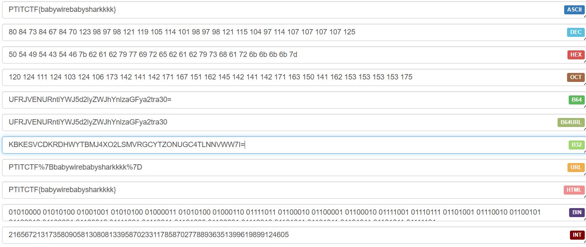
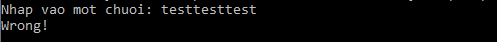

# Forensics

<table>
  <tr>
    <th>Challenge</th>
    <th>Description</th>
    <th>Difficulty</th>
    <th>Flag</th>
     <th>Author</th>
  </tr>
  <tr>
    <td>BabyShark</td>
    <td>Chúng tôi đã capture các gói tin mạng và bạn cần phân tích nó để thu thập thông tin quan trọng. Xem thật kĩ bạn sẽ thấy nội dung cần tìm.</td>
    <td>Easy</td>
    <td>PTITCTF{babywirebabysharkkkk}</td>
    <td>Haind</td>
  </tr>
  <tr>
    <td>PcapDump</td>
    <td>Họ đã làm gì với máy của tôi. Hãy kiếm tra các gói tin và đánh giá. </td>
    <td>Easy</td>
    <td>PTITCTF{3xp0rt_F1l3_Fr0m_pc4p$}</td>
    <td>Haind</td>
  </tr>
    <tr>
    <td>7Z</td>
    <td>File zip có thật sự an toàn, hãy kiểm tra nó.</td>
    <td>Medium</td>
    <td>PTITCTF{T0n_T0n_1s_My_Fr13nd!@#txc!@#}</td>
      <td>Haind</td>
  </tr>
  <tr>
    <td>In front of Image</td>
    <td>Đằng sau bức ảnh có ẩn chứa 1 điều bí mật.</td>
    <td>Medium</td>
    <td>PTITCTF{D11_In_Front_Of_IMG_6861696e64}</td>
    <td>Haind</td>
  </tr>
  <tr>
    <td>Mem Search</td>
    <td>Tôi đã cài 1 vài phần mềm để học tập ngành an toàn thông tin. Nhưng có một vài vấn đề xảy ra và tôi đã bị lấy cắp 1 số thứ. Có thể máy tính của tôi đã bị nhiễm "Malware". Mỗi lần mở máy tôi cảm giác nó mở lên chậm hơn so với bình thường. Tôi đã tìm cách và lấy được file "mem" từ máy của tôi bạn hãy giúp tôi phân tích nó.</td>
    <td>Hard</td>
    <td>PTITCTF{v0latility_Fr4m3w0rk@@}</td>
    <td>Haind</td>
  </tr>
</table>

# Challenges


## BabyShark (Easy)

`Chúng tôi đã capture các gói tin mạng và bạn cần phân tích nó để thu thập thông tin quan trọng. Hãy xem thật kĩ bạn sẽ thấy nội dung cần tìm.`
- Đây là file đề bài cho

    

### Solution

- Phân tích các gói tin bằng wireshark thì có thể thấy 1 gói tin lạ từ mạng Ethernet. 

    


- Tiến hành xem nội dung của gói tin.

    

- lấy giá trị ra và thử decode nó dưới dạng `base32`.

    

### Flag
```
PTITCTF{babywirebabysharkkkk}
```

## PcapDump (Easy)

- Đây là file đề bài cho

    

### Solution

- Phân tích các gói tin bằng wireshark thì có thể thấy các file đã được `curl` ở object list. Tại đây có 1 file `flag.txt` và file `pcap.exe` là 2 file được `curl` tại ip lạ `103.197.185.145:1234`.

    


- Dump 2 file này ra và đọc. Đây là nội dung của file `flag.txt`. Phân tích file `pcap.exe`.

    

- Cơ bản thì chương trình trên cho chúng ta nhập vào 1 chuỗi và sau đó sẽ check xem chuỗi chúng ta nhập có đúng không. Vì vậy ta sẽ reverse file `exe` này.

    

- Ta sẽ nhập vào 1 chuỗi và nó được gán vào biến `Buffer` sau đó nó sẽ lấy các kí tự `-27` và so sánh với biến `v6`. Vì vậy việc ta cần làm chính là dùng mảng `v6` cộng với `27` từ đây ta sẽ ra được chuỗi cần nhập.

    ```
    v6 = [0] * 31
    v6[0] = 53
    v6[1] = 57
    v6[2] = 46
    v6[3] = 57
    v6[4] = 40
    v6[5] = 57
    v6[6] = 43
    v6[7] = 96
    v6[8] = 24
    v6[9] = 93
    v6[10] = 85
    v6[11] = 21
    v6[12] = 87
    v6[13] = 89
    v6[14] = 68
    v6[15] = 43
    v6[16] = 22
    v6[17] = 81
    v6[18] = 24
    v6[19] = 68
    v6[20] = 43
    v6[21] = 87
    v6[22] = 21
    v6[23] = 82
    v6[24] = 68
    v6[25] = 85
    v6[26] = 72
    v6[27] = 25
    v6[28] = 85
    v6[29] = 9
    v6[30] = 98
    for i in range(len(v6)):
        v6[i] = v6[i] +27
        print(chr(v6[i]), end="")

    #PTITCTF{3xp0rt_F1l3_Fr0m_pc4p$}
    ```
    

### Flag
```
PTITCTF{3xp0rt_F1l3_Fr0m_pc4p$}
```

## 7Z (Medium)

- Được cung cấp 1 file `Zip` nhưng không có mật khẩu.

  

### Solution

- Vì không có mật khẩu ta sẽ sử dụng `zip2john` để crack `password`.

- Ta sẽ tạo hash bằng cách sử dụng `rar2john` để lấy hash file.

  

- Ta đã crack được pass của `zip` là `123456789d`.

  

- Sau khi extract ra có thể thấy file ảnh không mở được và nó còn sai so với `signature` file ảnh. 

  

- Có thể thấy `signature` của file ảnh là `%PNG` nhưng ở đây nó bị đổi thành `P‰GN` và `IHDR` bị đổi thành `HIRD`. Từ đây có thể nhìn ra được thuật toán encrypt file ảnh là sẽ đổi chỗ các vị trí với nhau vị trí lẻ sang vị trí chẵn và vị trí chẵn sang vị trí lẻ. Ta tiến hành viết script để decrypt file ảnh này.

  

- Sau khi decrypt file ảnh ta có được 1 tấm ảnh hoàn chỉnh. Trong tấm ảnh có 1 đường dẫn `https://raw.githubusercontent.com/H4lst0n/naunau/main/README.md`
  
  
 
- Tại đây ta có được file mã hóa tiếp theo cần phân tích. Lấy data về và phân tích nó.

  

- Đầu tiên ta sẽ thử decode nó với `base64` xem thì thấy nó lỗi khi decode lần thứ 2, sau khi check lỗi thì có thể biết đoạn mã sau khi được decode với `base64` nó là `base32`. 

- Tiếp tục decode `base32` và check. Sau khi decode nó lại ra 1 đoạn `base64` nữa. Và tôi vẫn làm như vậy nó lại ra `base32`. Từ đây ta có thể đọc ra được thuật toán là encrypt bằng `base64` sau đó `base32` rồi lại `base64` `base32`. Tiến hành viết code để decryt đoạn mã cho đến khi có cụm từ `PTITCTF{` ta sẽ break khỏi vòng lặp.

  


### Flag
```
PTITCTF{T0n_T0n_1s_My_Fr13nd!@#txc!@#}
```

## In front of Image (Medium)

- Ta được cung cấp 1 bức ảnh.

    

### Solution

- Ta sẽ phân tích bức ảnh bằng `Hxd`. Nhìn qua thì thấy bức ảnh khá hoàn chỉnh và không có bất kì nội dung gì khác lạ.

    

- Khi kéo xuống cuối data của bức ảnh thì có 1 phần như sau và khi đọc ngược lại thì là `MZ` thì ta đã biết `signature` của file `exe` chính là `MZ`. Ta sẽ phải tiến hành reverse strings này lại để build thử lại thành 1 file `exe`.

    

- Sử dụng đoạn code sau để reverse file.
    ```
    with open('chall.jpg', 'rb') as image_file:
        hex_data = image_file.read()
    reversed_hex_data = hex_data[::-1]
    with open('new.exe', 'wb') as new_file:
        new_file.write(reversed_hex_data)
    ```
- Sau khi check bằng detect it easy thì thấy đây là 1 file `dll`.

   

- Thực hiện các kĩ thuật debug và phân tích dll thì thấy ở đây có sử dụng `rc4` để encrypt `key` và `cipher` ta sẽ viết lại script decode hoặc debug vào chương trình để lấy flag.

    

- `function_e` được gọi bởi `function_d` để decrypt rc4 sau đó in từng kí tự ra màn hình. Ta có thể viết 1 chương trình load dll để nó thực thi và in ra flag sau khi patch các `antidebug`. Đó cũng là 1 cách làm. Nhưng ở đây tôi sẽ tiến hành `debug`.

    

- `function_d` được call bởi `function_c` và đây là function đầu tiên nó sẽ được call sau khi `function_a` được gọi.

  

- Sau khi patch hết `antidebug` và đi theo flow của chương trình ta sẽ tìm được key sau đó tiếp tục là đến được `flag`.

  
  
### Flag
```
PTITCTF{D11_In_Front_Of_IMG_6861696e64}
```


## Mem Search	(Hard)

`
Tôi đã cài 1 vài phần mềm học tập ngành an toàn thông tin. Nhưng có một vài vấn đề xảy ra và tôi đã bị lấy cắp 1 số thứ. Có thể máy tính của tôi đã bị nhiễm "Malware". Mỗi lần mở máy tôi cảm giác nó mở lên chậm hơn so với bình thường. Tôi đã tìm cách và lấy được file mem từ máy của tôi bạn hãy giúp tôi phân tích nó.
`

### Solution

- Chúng ta được cho 1 file `analysis.mem` vì vậy ta sẽ sử dụng `volatility` để phân tích với file mem này.

- Ngoài ra tác giả có nói ở trên đề bài là có download các file cài đặt để thực hành, học tập thì chỉ có thể là các file `.exe` vì vậy ta sẽ chỉ tiến hành list các file `exe` có trên hệ thống máy tính.


  ```
  python3 volatility3/vol.py -f analysis.mem windows.filescan.FileScan | grep -E ".exe" > checkfile.txt
  ```

- Sau khi dump ta sẽ thu được 1 file `checkfile.txt` và cũng có các dấu hiệu khả nghi ngoài ra nó còn có các dấu hiệu như đề bài cho.

  

- Đây sẽ là 2 file ta nghi ngờ nhất.
  ```
  0x818e5e9bd7d0	\Users\analysis\AppData\Local\svhost.exeeRig	216
  0x818e5e9c0200	\Users\analysis\Desktop\What1sTh1s@@.exe	216
  ```
- Đầu tiên là file `svhost.exe`. File này bị fake tên với file `svchost.exe` của windows ngoài ra nó còn được đặt trong thư mục `\Users\analysis\AppData\Local`. Có thể khẳng định là file chúng ta sẽ target vào.

- File thứ 2 có 1 cái tên khá là lạ nằm ở thư mục chính của desktop. Ta cũng sẽ tiến hành dump nó ra và phân tích. 
  

- Đây là 2 file ta đã dump được ra
  

- Nội dung của file `svhost.exe`
  

- Có 1 đoạn base64 mã hóa ở dưới ta decode nó.
  ```
  UGFydCAxOiBQVElUQ1RGe3YwbGF0aWxpdHlf
  ```
- Đây là phần đầu của flag.
  ```
  Part 1: PTITCTF{v0latility_
  ```

- Phân tích file thứ 2. Đây là 1 file exe 64bit thực hiện các kĩ thuật rev file và check file với các tools.
  

- Sau khi check với `Resource Hacker` ta sẽ thấy 1 strings được đặt trong `String Table`.

  

- Nội dung của nó như sau:
  ```
  STRINGTABLE
  LANGUAGE LANG_NEUTRAL, SUBLANG_NEUTRAL
  {
    101, 	"UGFydCAyOiBGcjRtM3cwcmtAQH0="
  }

  ```
- Sau khi decode ta thu được phần 2 của flag.
  ```
  Part 2: Fr4m3w0rk@@}
  ```

### Flag
```
PTITCTF{v0latility_Fr4m3w0rk@@}
```
