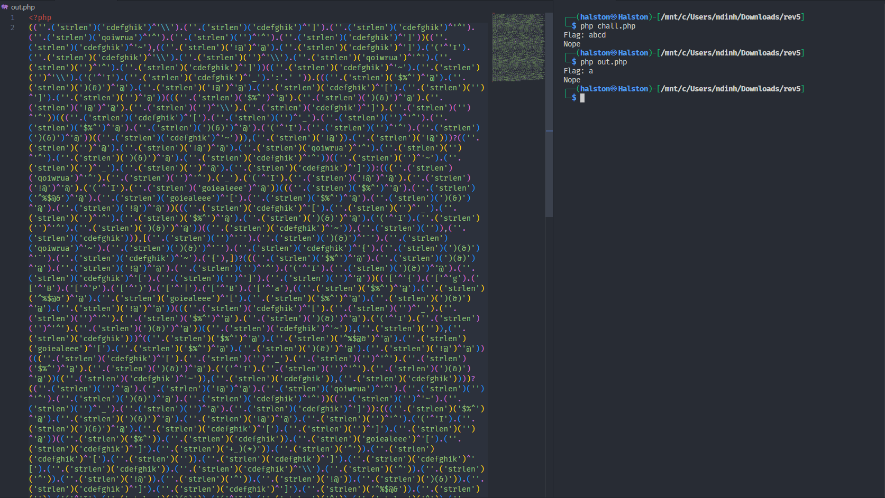

# Reverse Engineering

<table>
  <tr>
    <th>Challenge</th>
    <th>Description</th>
    <th>Difficulty</th>
    <th>Flag</th>
  </tr>
  <tr>
    <td>rev1</td>
    <td>pass: ptitctf2024</td>
    <td>Easy</td>
    <td>PTITCTF{D0n't_rUn_3x3_0v0}</td>
  </tr>
  <tr>
    <td>rev2</td>
    <td>Math equations Grade 3. pass: ptitctf2024</td>
    <td>Easy</td>
    <td>PTITCTF{14506909c43e869034854821c}</td>
  </tr>
    <tr>
    <td>rev3</td>
    <td>pass: ptitctf2024              author: Manhdx</td>
    <td>Medium</td>
    <td>PTITCTF{py1nst4ll3r_g0_g0_brhhhh676fa5e5f}</td>
  </tr>
  <tr>
    <td>rev4</td>
    <td>pass: ptitctf2024              author: Manhdx</td>
    <td>Medium</td>
    <td>PTITCTF{g0l4ng_1s_v3ry_funny_r1ght?}</td>
  </tr>
  <tr>
    <td>rev5</td>
    <td>pass: ptitctf2024              author: Manhdx</td>
    <td>Hard</td>
    <td>PTITCTF{phP_1s_A_hehe}</td>
  </tr>
</table>

## rev1 (Easy)

### Solution

- Khi check các strings của file thì có 1 strings là "This is your flag: ", ta sẽ nhảy đến đó và check xem hàm này có gì đặc biệt.

    

- Thì có thể thấy hàm này sẽ `puts` flag của chúng ta ra màn hình vì vậy việc cần làm chỉ cần lấy giá trị mang ra xor lại.


    ```python
    flag = [34, 49, 63, 49, 49, 39, 35, 9, 33, 70, 11, 85, 7, 58, 0, 48, 24, 58, 65, 11, 86, 45, 85, 0, 85, 15]


    x = [0] * len(flag)
    a = "reverse"
    for i in range(len(flag)):
        x[i] = flag[i]  ^ ord(a[i%len(a)])

    print("".join(chr(i) for i in x))
    ```

### Flag
```
PTITCTF{D0n't_rUn_3x3_0v0}
```

## rev2 (Easy)

- Ở bài này được yêu cầu nhập 100 giá trị của mảng `v5` và sau khi check qua các phương trình nếu thỏa mãn các phương trình thì ta sẽ có thể lấy được flag.

    

- Đây là các phương trình ta cần tìm ra để thỏa mãn:

    ```c
    _BOOL8 __fastcall check_equations(int *a1)
    {
    return *a1 + a1[1] == 4
        && a1[1] + a1[2] == 6
        && a1[2] + a1[3] == 8
        && a1[3] + a1[4] == 10
        && a1[4] + a1[5] == 12
        && a1[5] + a1[6] == 14
        && a1[6] + a1[7] == 16
        && a1[7] + a1[8] == 18
        && a1[8] + a1[9] == 20
        && a1[9] + a1[10] == 22
        && a1[10] + a1[11] == 24
        && a1[11] + a1[12] == 26
        && a1[12] + a1[13] == 28
        && a1[13] + a1[14] == 30
        && a1[14] + a1[15] == 32
        && a1[15] + a1[16] == 34
        && a1[16] + a1[17] == 36
        && a1[17] + a1[18] == 38
        && a1[18] + a1[19] == 40
        && a1[19] + a1[20] == 42
        && a1[20] + a1[21] == 44
        && a1[21] + a1[22] == 46
        && a1[22] + a1[23] == 48
        && a1[23] + a1[24] == 50
        && a1[24] + a1[25] == 52
        && a1[25] + a1[26] == 54
        && a1[26] + a1[27] == 56
        && a1[27] + a1[28] == 58
        && a1[28] + a1[29] == 60
        && a1[29] + a1[30] == 62
        && a1[30] + a1[31] == 64
        && a1[31] + a1[32] == 66
        && a1[32] + a1[33] == 68
        && a1[33] + a1[34] == 70
        && a1[34] + a1[35] == 72
        && a1[35] + a1[36] == 74
        && a1[36] + a1[37] == 76
        && a1[37] + a1[38] == 78
        && a1[38] + a1[39] == 80
        && a1[39] + a1[40] == 82
        && a1[40] + a1[41] == 84
        && a1[41] + a1[42] == 86
        && a1[42] + a1[43] == 88
        && a1[43] + a1[44] == 90
        && a1[44] + a1[45] == 92
        && a1[45] + a1[46] == 94
        && a1[46] + a1[47] == 96
        && a1[47] + a1[48] == 98
        && a1[48] + a1[49] == 100
        && a1[49] + a1[50] == 102
        && a1[50] - a1[51] == 104
        && a1[51] + a1[52] == 106
        && a1[52] + a1[53] == 108
        && a1[53] + a1[54] == 110
        && a1[54] + a1[55] == 112
        && a1[55] + a1[56] == 114
        && a1[56] + a1[57] == 116
        && a1[57] + a1[58] == 118
        && a1[58] + a1[59] == 120
        && a1[59] + a1[60] == 122
        && a1[60] + a1[61] == 124
        && a1[61] + a1[62] == 126
        && a1[62] + a1[63] == 128
        && a1[63] + a1[64] == 130
        && a1[64] + a1[65] == 132
        && a1[65] + a1[66] == 134
        && a1[66] + a1[67] == 136
        && a1[67] + a1[68] == 138
        && a1[68] + a1[69] == 140
        && a1[69] + a1[70] == 142
        && a1[70] + a1[71] == 144
        && a1[71] + a1[72] == 146
        && a1[72] + a1[73] == 148
        && a1[73] + a1[74] == 150
        && a1[74] + a1[75] == 152
        && a1[75] + a1[76] == 154
        && a1[76] + a1[77] == 156
        && a1[77] + a1[78] == 158
        && a1[78] + a1[79] == 160
        && a1[79] + a1[80] == 162
        && a1[80] + a1[81] == 164
        && a1[81] + a1[82] == 166
        && a1[82] + a1[83] == 168
        && a1[83] + a1[84] == 170
        && a1[84] + a1[85] == 172
        && a1[85] + a1[86] == 174
        && a1[86] + a1[87] == 176
        && a1[87] + a1[88] == 178
        && a1[88] + a1[89] == 180
        && a1[89] + a1[90] == 182
        && a1[90] + a1[91] == 184
        && a1[91] + a1[92] == 186
        && a1[92] + a1[93] == 188
        && a1[93] + a1[94] == 190
        && a1[94] + a1[95] == 192
        && a1[95] + a1[96] == 194
        && a1[96] + a1[97] == 196
        && a1[97] + a1[98] == 198
        && a1[98] + a1[99] == 200
        && a1[99] + *a1 == 202;
    }
    ```
### Solution

- Vậy việc ta cần làm sẽ là đi tính toán các giá trị trên. Dưới đây là code tính toán tính ra các giá trị.

```python
from z3 import *
solver = Solver()
x = [Int(f'x{i}') for i in range(100)]

solver.add(x[0] + x[1] == 4)
solver.add(x[1] + x[2] == 6)
solver.add(x[2] + x[3] == 8)
solver.add(x[3] + x[4] == 10)
solver.add(x[4] + x[5] == 12)
solver.add(x[5] + x[6] == 14)
solver.add(x[6] + x[7] == 16)
solver.add(x[7] + x[8] == 18)
solver.add(x[8] + x[9] == 20)
solver.add(x[9] + x[10] == 22)
solver.add(x[10] + x[11] == 24)
solver.add(x[11] + x[12] == 26)
solver.add(x[12] + x[13] == 28)
solver.add(x[13] + x[14] == 30)
solver.add(x[14] + x[15] == 32)
solver.add(x[15] + x[16] == 34)
solver.add(x[16] + x[17] == 36)
solver.add(x[17] + x[18] == 38)
solver.add(x[18] + x[19] == 40)
solver.add(x[19] + x[20] == 42)
solver.add(x[20] + x[21] == 44)
solver.add(x[21] + x[22] == 46)
solver.add(x[22] + x[23] == 48)
solver.add(x[23] + x[24] == 50)
solver.add(x[24] + x[25] == 52)
solver.add(x[25] + x[26] == 54)
solver.add(x[26] + x[27] == 56)
solver.add(x[27] + x[28] == 58)
solver.add(x[28] + x[29] == 60)
solver.add(x[29] + x[30] == 62)
solver.add(x[30] + x[31] == 64)
solver.add(x[31] + x[32] == 66)
solver.add(x[32] + x[33] == 68)
solver.add(x[33] + x[34] == 70)
solver.add(x[34] + x[35] == 72)
solver.add(x[35] + x[36] == 74)
solver.add(x[36] + x[37] == 76)
solver.add(x[37] + x[38] == 78)
solver.add(x[38] + x[39] == 80)
solver.add(x[39] + x[40] == 82)
solver.add(x[40] + x[41] == 84)
solver.add(x[41] + x[42] == 86)
solver.add(x[42] + x[43] == 88)
solver.add(x[43] + x[44] == 90)
solver.add(x[44] + x[45] == 92)
solver.add(x[45] + x[46] == 94)
solver.add(x[46] + x[47] == 96)
solver.add(x[47] + x[48] == 98)
solver.add(x[48] + x[49] == 100)
solver.add(x[49] + x[50] == 102)
solver.add(x[50] - x[51] == 104)
solver.add(x[51] + x[52] == 106)
solver.add(x[52] + x[53] == 108)
solver.add(x[53] + x[54] == 110)
solver.add(x[54] + x[55] == 112)
solver.add(x[55] + x[56] == 114)
solver.add(x[56] + x[57] == 116)
solver.add(x[57] + x[58] == 118)
solver.add(x[58] + x[59] == 120)
solver.add(x[59] + x[60] == 122)
solver.add(x[60] + x[61] == 124)
solver.add(x[61] + x[62] == 126)
solver.add(x[62] + x[63] == 128)
solver.add(x[63] + x[64] == 130)
solver.add(x[64] + x[65] == 132)
solver.add(x[65] + x[66] == 134)
solver.add(x[66] + x[67] == 136)
solver.add(x[67] + x[68] == 138)
solver.add(x[68] + x[69] == 140)
solver.add(x[69] + x[70] == 142)
solver.add(x[70] + x[71] == 144)
solver.add(x[71] + x[72] == 146)
solver.add(x[72] + x[73] == 148)
solver.add(x[73] + x[74] == 150)
solver.add(x[74] + x[75] == 152)
solver.add(x[75] + x[76] == 154)
solver.add(x[76] + x[77] == 156)
solver.add(x[77] + x[78] == 158)
solver.add(x[78] + x[79] == 160)
solver.add(x[79] + x[80] == 162)
solver.add(x[80] + x[81] == 164)
solver.add(x[81] + x[82] == 166)
solver.add(x[82] + x[83] == 168)
solver.add(x[83] + x[84] == 170)
solver.add(x[84] + x[85] == 172)
solver.add(x[85] + x[86] == 174)
solver.add(x[86] + x[87] == 176)
solver.add(x[87] + x[88] == 178)
solver.add(x[88] + x[89] == 180)
solver.add(x[89] + x[90] == 182)
solver.add(x[90] + x[91] == 184)
solver.add(x[91] + x[92] == 186)
solver.add(x[92] + x[93] == 188)
solver.add(x[93] + x[94] == 190)
solver.add(x[94] + x[95] == 192)
solver.add(x[95] + x[96] == 194)
solver.add(x[96] + x[97] == 196)
solver.add(x[97] + x[98] == 198)
solver.add(x[98] + x[99] == 200)
solver.add(x[99] + x[0] == 202)


if solver.check() == sat:
    model = solver.model()
    solution = [model[x[i]].as_long() for i in range(100)]
    a = b = c = d = e = f = g = h = 0
    for i in range(100):
        value = model[x[i]].as_long()
        if value % 2 == 0: a += value
        if value % 3 == 0: b += value
        if value % 4 == 0: c += value
        if value % 5 == 0: d += value
        if value % 6 == 0: e += value
        if value % 7 == 0: f += value
        if value % 8 == 0: g += value
        if value % 9 == 0: h += value
    print(a)
    buf = "PTITCTF{{{:x}{:x}{:x}{:x}{:x}{:x}{:x}{:x}}}".format(a, b, c, d, e, f, g, h)
    print(buf)
    print(solution)
    # from pwn import *

    # p = process("./Math")

    # for i in range(6):
    #     print(p.recvline().decode(), end = "")

    # for i in range(100):
    #     payload = str(model[x[i]].as_long())
    #     print(payload)
    #     p.sendline(payload)
    # p.interactive()
```

### Flag
```
PTITCTF{14506909c43e869034854821c}
```
## rev3 (medium)

### Solution

- Ở bài này nhận được 1 file `exe` được biên dịch từ `python`. Sử dụng `pyinstxtractor` `https://github.com/extremecoders-re/pyinstxtractor` để extract ra các file pyc và các thư viện mà chương trình kia sử dụng.


    

- File ta cần phân tích chính là `chall.pyc`. Để decompile file này ta sẽ ném lên `pylingual`.

    

- Đây chính là `source` của chương trình `exe` kia.

```python
# Decompiled with PyLingual (https://pylingual.io)
# Internal filename: chall.py
# Bytecode version: 3.12.0rc2 (3531)
# Source timestamp: 1970-01-01 00:00:00 UTC (0)

def main():
    a = [201, 109, 176, 225, 31, 132, 131, 32, 183, 80, 161, 50, 159, 19, 105, 46, 166, 227, 151, 123, 56, 143, 47, 50, 223, 162, 216, 94, 25, 170, 78, 169, 34, 96, 22, 68, 69, 48, 57, 154, 155, 64]
    b = [153, 57, 249, 181, 92, 208, 197, 91, 199, 41, 144, 92, 236, 103, 93, 66, 202, 208, 229, 36, 95, 191, 112, 85, 239, 253, 186, 44, 113, 194, 38, 193, 20, 87, 32, 34, 36, 5, 92, 175, 253, 61]
    flag = [0 for i in range(42)]
    c = input('Flag: ')
    if len(c) != 42:
        print('Incorrect!')
        return -1
    for i in range(42):
        if not b[i] == ord(c[i]) ^ a[i]:
            print('Incorrect!')
            return -1
    else:
        print('Correct!')
        return 0
if __name__ == '__main__':
    main()
```
- Viết lại đoạn code để tìm ra `input`.
    ```python
    a = [201, 109, 176, 225, 31, 132, 131, 32, 183, 80, 161, 50, 159, 19, 105, 46, 166, 227, 151, 123, 56, 143, 47, 50, 223, 162, 216, 94, 25, 170, 78, 169, 34, 96, 22, 68, 69, 48, 57, 154, 155, 64]
    b = [153, 57, 249, 181, 92, 208, 197, 91, 199, 41, 144, 92, 236, 103, 93, 66, 202, 208, 229, 36, 95, 191, 112, 85, 239, 253, 186, 44, 113, 194, 38, 193, 20, 87, 32, 34, 36, 5, 92, 175, 253, 61]
    c = [x ^ y for x, y in zip(a, b)]
    print("".join(chr(i) for i in c))
    ```

### Flag
```
PTITCTF{py1nst4ll3r_g0_g0_brhhhh676fa5e5f}
```

## rev4 (Medium)

### Solution
- Hàm main sẽ nhận vào `input` và chia `input` của chúng ta ra thành 2 phần mỗi phần 18 kí tự.

    

- Đi qua từng hàm 1 để check.
  
    

- Tại đây ta đã thỏa mãn với yêu cầu đề bài nhập vào `input` 36 kí tự và sau đó đi đến hàm `checkDecrypt`. Biến `a1` sẽ lưu vị trí flag bị `encrypt`. 

    

- Hiểu cơ bản nó sẽ check `input` của chúng ta nhập vào lấy xor với giá trị và so sánh với phần flag bị encrypt.

    

- Ngoài ra trước khi vào phép toán xor thì input của chúng ta cũng đã bị thay đổi.
    
    

- Quay trở lại hàm trước đó thì có thể thấy rằng biến input của chúng ta đã được gán bằng giá trị mới bằng thuật toán sau.

    

- Vậy bây giờ ta sẽ tiến hành viết script để decrypt lại 1 nửa flag đầu với data đã bị encrypt.

    ```python
    flag1 = [
        0x32, 0x37, 0x29, 0x35, 0x25, 0x3B, 0x2E,
        0xE0, 0xCD, 0x1B, 0xD4, 0x1D, 0xD8, 0xD6,
        0xCF, 0x22, 0xE1, 0xD2
    ]
    print(len(flag1))
    for i in range(len(flag1)):
        flag1[i] = (flag1[i] ^ 0x42) - 32 - i
    print(flag1)
    print("".join(chr(i) for i in flag1))
    ```
- Nửa flag đầu:
  
    

- Tương tự với hàm thứ 2 ta cũng sẽ làm như vậy.

    
    

- Script:
    ```python
    flag1 = [
        0x32, 0x37, 0x29, 0x35, 0x25, 0x3B, 0x2E,
        0xE0, 0xCD, 0x1B, 0xD4, 0x1D, 0xD8, 0xD6,
        0xCF, 0x22, 0xE1, 0xD2
    ]
    print(len(flag1))
    for i in range(len(flag1)):
        flag1[i] = (flag1[i] ^ 0x42) - 32 - i
    print(flag1)
    print("".join(chr(i) for i in flag1))

    flag2 = [
        0x3E, 0x70, 0x30, 0x38, 0x03, 0x0B, 0x3B,
        0x31, 0x3E, 0x22, 0x0D, 0x39, 0x79, 0x30,
        0x3E, 0x23, 0x17, 0xD6
    ]
    print(len(flag2))
    for i in range(18, len(flag2)*2):
        flag2[i-18] = (flag2[i-18] ^ 0x56) + 32 - i
    print(flag2)
    print("".join(chr(i) for i in flag2))
    ``` 
- Nửa flag sau:
  
    

    

### Flag
```
PTITCTF{g0l4ng_1s_v3ry_funny_r1ght?}
```

## Rev5 (Hard)

### Solution
- Đề bài yêu cầu chúng ta nhập flag và chương trình sẽ check.

    

- Phân tích source code của chương trình. Sau khi thử xor các kí tự sau thì thu được 1 đoạn mã:
    ```
    ('@'^'_'^','^'@') = s
    ('&'^'_'^'&'^'+') = t
    ('_'^'+'^'-'^'+') = r
    (','^'@'^','^',') = l
    (']'^'@'^'%'^']') = e
    ('%'^'@'^'.'^'%') = n
    ```
- Viết code regex full source.
    ```python
    import re
    import string
    import subprocess

    printable = string.printable[:-7]

    s = ""
    with open("chall.php", "r") as f:
        s = f.read()

    pattern = r"\(([^()]+)\)"
    matches = re.findall(pattern, s)
    matches = set(matches)
    for i in matches:
        match = ""
        if ('\'^\'' in i):
            match = i
            php_code = "<?php\n" + "echo " + match +";\n?>"
            with open("temp.php", "w") as r:
                r.write(php_code)
            result = subprocess.run(['php',  'temp.php'], stdout=subprocess.PIPE, stderr=subprocess.PIPE, text=True)
            if ('s' in result.stdout or 't' in result.stdout or 'r' in result.stdout or 'l' in result.stdout or 'e' in result.stdout or 'n' in result.stdout):
                s = s.replace(match, "\'"+ result.stdout + "\'")
    s = s.replace("(('s').('t').('r').('l').('e').('n'))", "('strlen')")
    with open("out.php", "w") as f:
        f.write(s)
    ```

- Sau khi regex xong thu được source mới:

    

- Tiếp tục regex tiếp các chuỗi `strlen(_)` để thu gọn lại code.
    ```python
    import re
    import string
    import subprocess

    printable = string.printable[:-7]


    s = ""
    with open("chall.php", "r") as f:
        s = f.read()


    pattern = r"\(([^()]+)\)"
    matches = re.findall(pattern, s)
    matches = set(matches)
    for i in matches:
        match = ""
        if ('\'^\'' in i):
            match = i
            php_code = "<?php\n" + "echo " + match +";\n?>"
            with open("temp.php", "w") as r:
                r.write(php_code)
            result = subprocess.run(['php',  'temp.php'], stdout=subprocess.PIPE, stderr=subprocess.PIPE, text=True)
            if ('s' in result.stdout or 't' in result.stdout or 'r' in result.stdout or 'l' in result.stdout or 'e' in result.stdout or 'n' in result.stdout):
                s = s.replace(match, "\'"+ result.stdout + "\'")
    s = s.replace("(('s').('t').('r').('l').('e').('n'))", "('strlen')")
    with open("out.php", "w") as f:
        f.write(s)
    pattern = r"\('(\w*)'\)\('([^']*)'\)"
    matches = re.findall(pattern, s)
    matches = set(matches)

    for i in matches:
        match = list(i)
        php_code = "<?php\n" + "echo " + match[0] + '(\'' + match[1] + '\')' +";\n?>"
        rep = '(\''+match[0]+'\')' + '(\'' + match[1] + '\')'
        with open("temp.php", "w") as r:
            r.write(php_code)
        result = subprocess.run(['php',  'temp.php'], stdout=subprocess.PIPE, stderr=subprocess.PIPE, text=True)
        s = s.replace(rep, "\'"+ result.stdout + "\'")
    with open("out2.php", "w") as f:
        f.write(s)
    ```
- Sau khi đổi hết các chuỗi `strlen` về chuỗi ta có source mới:
    

- Giờ là ta sẽ cần replace các dấu `.`, `(` và `)`.
    ```python

    a = s.replace('(', '.')
    a = a.replace(')', '.')
    a = a.replace('...', '.')
    a = a.replace('..', '.')

    b = list(set(a[6:-3].split('.')))
    s = s.replace('\'(\'^\'I\'', '\'a\'')
    for i in b:
        if ('^' in i and len(i) >1):
            php_code = "<?php\n" + "echo " + i  +";\n?>"
            with open("temp.php", "w") as r:
                r.write(php_code)
            result = subprocess.run(['php',  'temp.php'], stdout=subprocess.PIPE, stderr=subprocess.PIPE, text=True)
            if (result.stdout == '\''):
                s = s.replace(i, "\'\\"+ result.stdout + "\'")
            elif (result.stdout not in printable):
                continue
            else:
                s = s.replace(i, "\'"+ result.stdout + "\'")
    s = s.replace('\'\'.', '')
    s = s.replace('\'\'', '\'')
    s = s.replace('\').(\'', '')

    with open("out3.php", "w") as f:
        f.write(s)
    ```

- File source mới đã khá là dễ đọc và dễ hiểu hơn.

    

    ```php
    <?php
    define('F', readline('Flag: '));

    if (strcmp(strlen(constant('F')), '22')) {
        printf('Nope');
    } else {
        if (in_array(substr(constant('F'), 0, 8), ['PTITCTF{'])) {
            if (strnatcmp('{gBP)|Ba', substr(constant('F'), 0, 8) ^ substr(constant('F'), 8, 8))) {
                printf('Nope');
            } else {
                if (strnatcmp('38be61c0ec8d112124ee50a4a118926d', md5(substr(constant('F'), 16, 5)))) {
                    printf('Nope');
                } else {
                    printf('yes');
                }
            }
        } else {
            printf('Nope');
        }
    }
    ?>
    ```

- Code solve:
    ```python
    s = [0x20, 0x3c, 0x19, 0xb, 0x72, 0x27, 0x19, 0x3a]
    s2 = "PTITCTF{"
    import string
    a = string.printable[:-7]
    print(a)
    for i in range(len(s)):
        print(chr(ord(s2[i])^s[i]),end='')
    ```
### Flag
```
PTITCTF{phP_1s_A_hehe}
```
